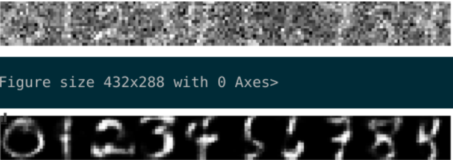

# Autoencoder from scratch

This is a final project in a machine learning course of our training. The objective of this project is to design from scratch a neural network to realize an auto-encoder based on a linear or convolutional (1D) layer.

## Features:

- Linear layer
- Convolutional layer (1D)
- Activation functions: Tanh, Sigmoide, Relu
- Loss functions: MSE (Mean Square Error), BCE (Binary Cross Entropy), NLL (Negative Log-Likelihood)
- Multi-class classification using a neural network
- Reconstruction of the image after strong compression
- Image denoised from autoencoderDataset used

## Dataset

[USPS Dataset](https://www.kaggle.com/bistaumanga/usps-dataset)

## Insights

- Image reconstructed after strong compression

  

- Train the Autoencoder model using digits from our dataset and try to recognize the digits using data containing noise

  - 20% of noise

  

  - 40% of noise

  

  - 60% of noise

  

- Train the Autoencoder model using a raw data set and try to recognize the digits without noise

  

## Authors

- [Marcelin Seble](https://www.linkedin.com/in/margaal/)
- [Eleni Pistiloglou](https://www.linkedin.com/in/eleni-pistiloglou-9220391a8/) 